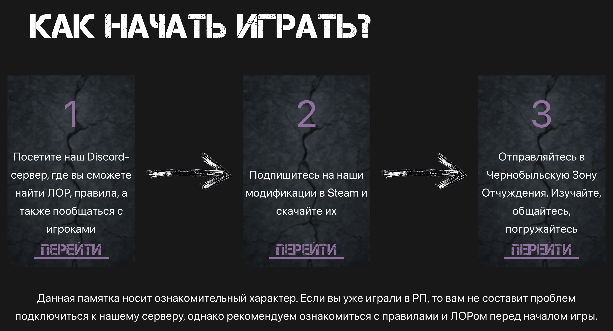
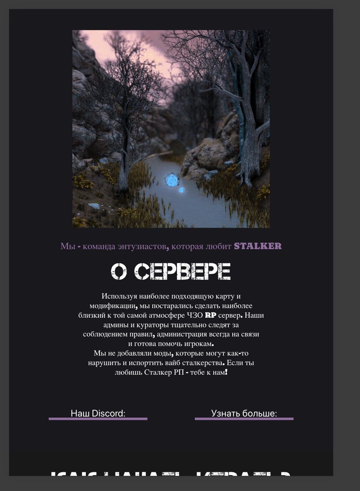

# ☢️ Last Zone RP — Промо-сайт STALKER RolePlay сервера

[](https://ostrovskyiv.github.io/Last-Zone-RP/)
[](https://github.com/ostrovskyiv/Last-Zone-RP/actions)

> **[🌐 ПЕРЕЙТИ НА САЙТ](https://ostrovskyiv.github.io/Last-Zone-RP/)**

Современный, адаптивный лендинг для игрового сервера в сеттинге **S.T.A.L.K.E.R.**, построенный на стеке **Vue 3 + Vite + Tailwind CSS**.

---

## 🚀 Быстрый старт

Если вы хотите запустить проект локально:

1. **Клонируйте репозиторий:**
   ```bash
   git clone https://github.com/ostrovskyiv/Last-Zone-RP.git
   ```
2. **Перейдите в папку проекта:**
   ```bash
   cd Last-Zone-RP
   ```
3. **Установите зависимости:**
   ```bash
   npm install
   ```
4. **Запустите сервер для разработки:**
   ```bash
   npm run dev
   ```
5. Откройте [http://localhost:5173](http://localhost:5173) в браузере.

---

## 🛠 Технологический стек

*   **Framework:** [Vue 3](https://vuejs.org/) (Composition API + Script Setup)
*   **Сборщик:** [Vite](https://vitejs.dev/)
*   **Стили:** [Tailwind CSS](https://tailwindcss.com/)
*   **Язык:** [TypeScript](https://www.typescript.org/)
*   **Деплой:** GitHub Actions (автоматическая сборка при пуше в `main`)

---

## ✨ Особенности и "Фишки" проекта

### 1. Интерактивная 3D-Галерея
Одной из главных особенностей является секция галереи с эффектом переворота карт (Flip Cards).
*   **Логика:** При наведении (`hover`) карта плавно разворачивается на 180 градусов, показывая другое изображение.
*   **Реализация:** Использованы CSS-свойства `preserve-3d` и `backface-visibility: hidden` для создания честного 3D-эффекта.


### 2. Секция "Как начать играть"
Пошаговая инструкция для игроков, оформленная в стилистике игры.
*   Использование кастомных шрифтов (`capture-it`, `Caprasimo`) для передачи атмосферы сталкерства.
*   Адаптивные стрелки, которые меняют направление в зависимости от размера экрана.



### 3. Полная адаптивность
Сайт полностью оптимизирован под мобильные устройства (использовал стандартные размеры указанные пользователем при составлении тз,использовал базовые sm md lg xl 2xl), планшеты и мониторы высокого разрешения благодаря адаптивной сетке Tailwind CSS.


---

## 📋 Правовая информация и референсы

Данный проект опубликован в открытом доступе с **официального разрешения владельцев сервера Last Zone RP**.

*   **Дизайн и проектирование:** Весь визуальный интерфейс и структура сайта были разработаны мной с нуля.
*   **Координация:** Разработка проходила при активной координации команды проекта Last Zone.
*   **Первый макет (Figma):** Ссылка на мой первый черновой макет, который стал основой для текущего дизайна:  
    👉 **[Посмотреть макет в Figma](https://www.figma.com/design/CK3lQbscJ1mPBwHUTDtGRK/Untitled?node-id=0-1&p=f&t=FykEcyqVho7M053U-0)**

### Ресурсы проекта:
*   [Официальный сайт проекта (Основной)](https://lastzonerp.ru/)
*   [Альтернативный адрес](https://lastzone.ru/)

---

## 👨‍💻 Автор
Проект разработан **Ivan Ostrovsky** в 2025 году, по всем вопросам писать в Telegram или на Email.

*   **Telegram:** [@Bambuk_lov](https://t.me/Bambuk_lov)
*   **Email:** [ostrovskyiml@mail.com](mailto:ostrovskyiml@gmail.com)

---